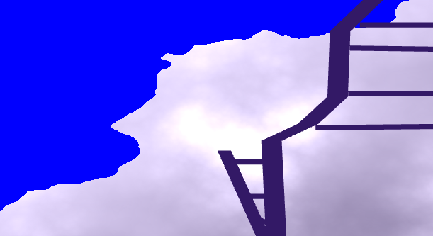
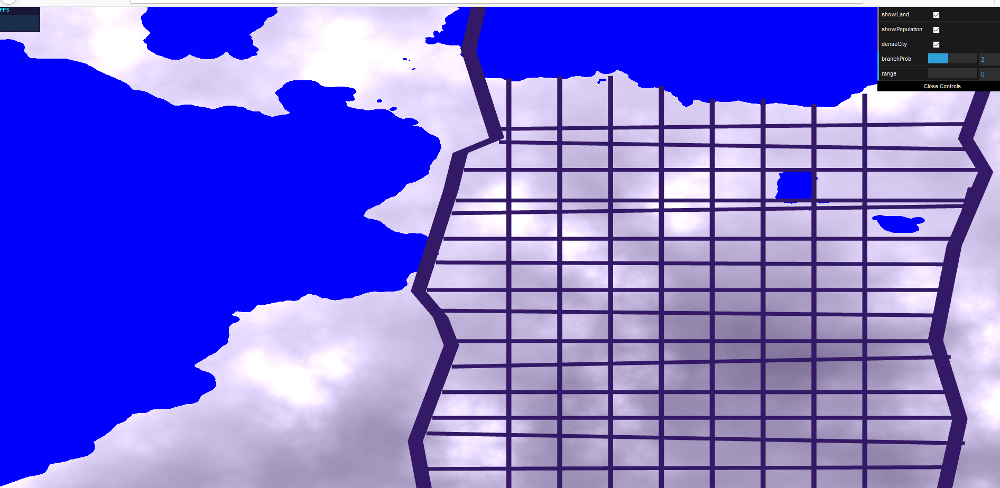
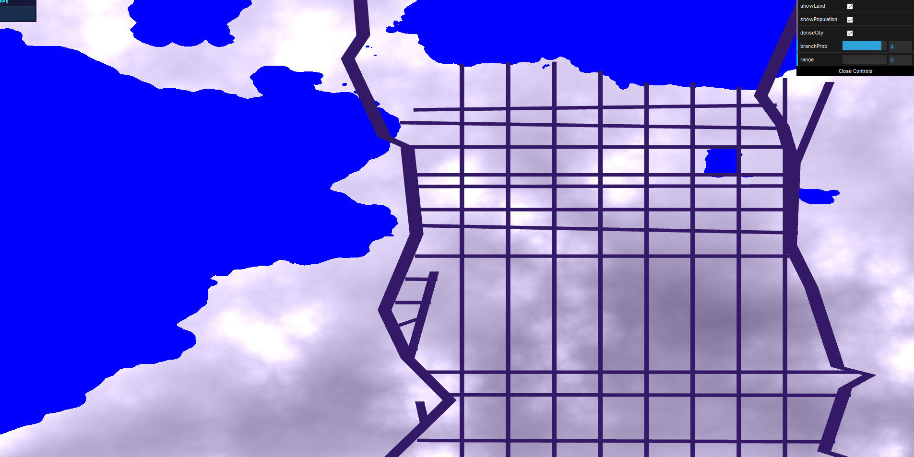
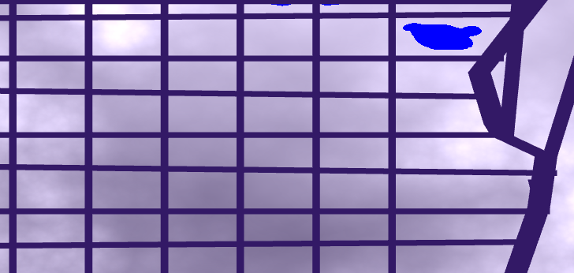
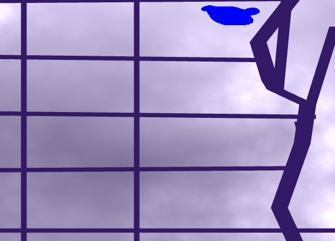

# Homework 5: Road Generation

Morgan Herrmann
moher@seas.upenn.edu

Live Demo : https://morganherrmann.github.io/roads/

## Assignment Requirements

#### 2D MAP
For the 2D map, I used a comination of FBM and worley noise to generate population density with a mixture of land and water terrain. In order to determine which portions of the screen were water, I simply set any noise calculation below a certain threshold to be water. The population density is shown as lighter patches of noise, where the lightest spots represent the highest population density. I set elevation to be represented by darker color, just to avoid confusion between the two.
The user can toggle the option to display the terrain, and can toggle the option to display the population density on the map.

#### Pseudo L System

I have two main pseudo LSystems that act as highways for the city.  
  - They begin from pseudo-random points on the land, within the bounds of the screen, avoiding starting in water.
  - In order to advance the turtle for each system, the turtle samples several random points within a reasonable threshhold distance.  Of these points, the turtle travels in the direction of the sampled point with the highest population.
  - When a road segment is finished generating, the turtle takes into account a random branching threshhold.  Again, nearby points are sampled to determine the spot with the highest population.  If the population is high enough, or past a certain threshhold value, the turtle will branch in this direction as well.
  -Each Edge/intersection is stored as a set of x/y coordinate pairs.  I store multiple sets of vec4[], where they are of the format (x1, y1, x2, y2). This is helpful for later calculations for intersections. (For more explanation of intersection awareness, see the 2D street layout section).  There are both highways and more grid like city streets that fill the interior of the highways.
  -In order to draw the edges, I created a rectangle Drawable that takes in two vec4s, and draws a shape connecting all 4 points.  This made drawing the road segments much easier to compute based on lines, and also gave more control over the line thickness.
  
  #### Drawing Rules
  - Following the paper, [Procedural Modeling of Cities](proceduralCityGeneration.pdf) I created a system of rules to determine road movement and branching.
  - Highway Method: Advance the turtle. For each point we advance to, sample several random points within a certain radius of the current turtle population.  Find the sampled point with the greatest population density, and advance in this direction.
  
  -Checkered Method : The checkered roads are aligned vertically and horizontally (with some random elements introduced). They have a predetermined width and height of about 0.1 units in the x and y direction, but by using random number functions, they are never an exact checkerboard and experience slight variation in direction, size, and orientation. This ensures intersections also occur at mostly 90 degrees.
   
    
  
  #### 2D street layout
  - There exists an overarching sparse layout of several highways, with many smaller roads in between.
  - The interior roads are less thick visually. I implemented this by determining first what kind of road the segment was, then passing the appropriate thickness as a parameter to my Square.ts, which will draw a proper rectangle segment.
  - Both checkered and highway layouts were used. 
  - Crossing water: Note that only the thicker highways will cross water.  The local roads have the option to extend as far as they wish, until they intersect water or a highway, in which case, they end.  This prevents local streets from extending over the water (yikes!).
  - SELF SENSITIVE ROADS - For this implementation, I first took into account the set of line segments within the highways.  For each local road, I computed it's minimum and maximum intersection with each of the highways. For each road, it would extend from water until it hit a highway, or be cut off between highways if it was encased between them.
  For each local road ---> Compare to all line segments making up the highways. Compute the intersections for each, and store the min and max intersection points based on whether the road is horizontal or vertical. If the minimum intersection point occurs where water exists, simply start the road at the water edge instead.
#### Modifiable features!

1) Dense City - Click to change the high/low density of local roads. High density includes more street blockes.
2) Range search - This determines how far the turtle will search for a highly populated area. A higher radius allows the turtle to sample points further away, which can allow it to travel faster to higher density regions.
3) Branching probability - This slider increases/decreses the likelihood of branching within the turtle.  Less branching results in generally straighter roads with less extensions or branches, and uses a random seed to determine when to branch. 

#### Improvements / Notes
Sometimes the intersections or roads generated can be a little wonky with the intersections, so please refresh the page if the initial result is not so perfect! SOme intersections calculations are a slight bit off, so refreshing and rebuilding the gnetwork tends to help.

##### Citations, etc
- Procedural City Generation Paper, cited above
- Emily's Piazza post about line intersection when generating road networks.

https://www.youtube.com/watch?v=Nt3pm0VJDXg

